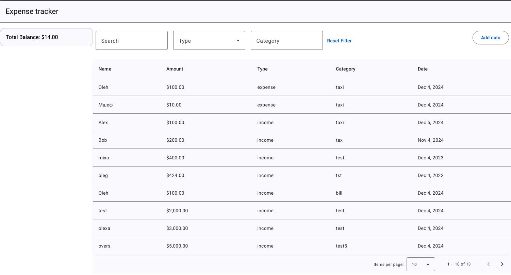

# **Expense Tracker Application**

### **Description:**

You need to create a web application for tracking personal finances. The user should be able to add expenses and incomes, view the overall balance, and filter records by categories.

### **Functional Requirements:**

1. **Adding Income and Expenses**
  - The user can add records for income and expenses through a form:
    - Name (required)
    - Amount (required, float, two decimal places)
    - Transaction type (income or expense)
    - Category (e.g., "Groceries," "Salary," "Entertainment," etc.)
    - Transaction date (default to current date but can be changed)
2. **Viewing Total Balance**
  - The application should display the current balance: the total amount of income minus expenses.
3. **Transaction List**
  - The user can view all transactions in a list format:
    - Transaction name
    - Amount
    - Category
    - Date
4. **Filtering Transactions**
  - The user can filter transactions by type (income or expense) and by categories.
  - The ability to sort records by date or amount.
5. **Data Persistence**
  - All data must be stored in localStorage so that records persist after a page reload.

### **Technical Requirements:**

- Angular latest version
- Keeping the code clean (use eslint for check)
- Readable and understandable names of variables, classes, functions and methods
- Use the types `any` and `unknown` as little as possible
- Use of third-party libraries is allowed
- Everything should to be developed taking into account the fact that in the future it is possible to add other types of questions.
- All application state and all data must be stored in local storage. That is, after reloading the page, the state of the application must be restored. All previously created questions and answers must be restored.
- Responsive design for convenient use on mobile devices. (optional)
